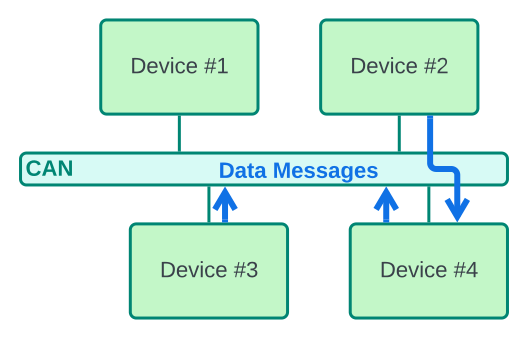
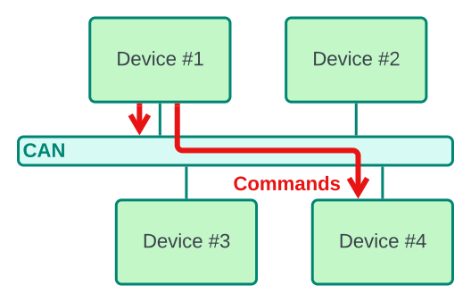

# qCAN - a simple CAN protocol

qCAN ("kwɪ-kæn" or "kju-kæn" ) is a  standard based on the CAN protocol. The main goal of the standard is to provide a minimalistic but efficient robotic communication protocol for fast development and simple debugging.

qCAN extends bare CAN with the following features:

- Each device sends periodically a message indicating that the device is accessible
- Each message contains data about Source and Target devices
- CAN frame is a message one of the following types:
    - 🔵 **Data** - e.g. sensor data
    - 🔴 **Command**
    - 🟡 **Presence** - each node says to the network that the node is connected

Data messages can be sent to the entire CAN network or to a specific device.

Commands can be send similarly to all devices or a particular device.

Presence messages must be sent at least once in 3 seconds by each device and can be addressed only to the entire CAN network.

**Base CAN configuration**:

- Bitrate: 125 kbits/s
- ID: 11 bits (standard mode) / 29 bits (extended mode)

## Addressing and Message Descriptor

Each device in the network has its unique Device ID. For the Standard Mode each device can have ID from 1 to 7, for the Extended Mode from 1 to 254.

The ID field of the CAN frame is used to describe the message.
The descriptor contains:

- Device ID of the sender
- Device ID of the target (0 for broadcasting)
- Message Type

This information is mapped in the ID bits in the way allowing easy reading in HEX.

On the picture bellow you can see a Standard CAN frame and a qCAN ID structure

An Extended CAN frame allows qCAN to put more information into the ID field:

## Message Types

|Msg Type (extended)|Name               |Description
|-                  |-                  |-
|0x0                |Presence Message   |Used for presence declaration each 3 seconds (see details bellow).
|0x1...0x15 (0x255) |DeviceData         |Device specific data defined by each device.
|0xF (0xFF)       |Command            |Command format is different for each device, but using this data ID all nodes in the network can understand that this message is an input for a particular node.

Examples of Message IDs:

- 0x200 - a Presence message of the device with ID 0x2
- 0x52F - a Command message of the device 0x5 to 0x2
- 0x701 - a Data message of the device 0x7 for everybody
- 0xAA00000 - a Presence message of the device with ID 0xAA
- 0x01020FF - a Command message of the device 0x1 to 0x2
- 0x0C00001 - a Data message of the device 0xC for everybody

### Presence Messages

A device is online if it declares its presence at least once per 3 seconds.

To declare being online the device should send a CAN frame with following content:

- Identifier:
    - Source ID: ID of the device declaring the presence
    - Target ID: 0 - broadcast message
    - Message Type: 0x0 - presence message
- Data:
    - Data0: qCAN Standard **Major** Version
    - Data1: qCAN Standard **Minor** Version
    - Data2: qCAN Standard **Patch** Version

## Versioning

Note: **Until version 1.0.0 this section can be violated**

The version consists of 3 numbers: `Major`.`Minor`.`Patch` (e.g. 2.3.9)

- All devices using the same `Major` should be able to interact with other devices at least partly
- All devices using the same `Minor` should be able to fully interact with each other and have to have the same feature set

## Compatible libraries

Libraries bellow are developed inside the Zakhar project and support ZakharCAN.

- Arduino: https://github.com/Zakhar-the-Robot/lib_arduino_canbus
- ESP-IDF: https://github.com/Zakhar-the-Robot/lib_espidf_canbus
- STM32: https://github.com/Zakhar-the-Robot/lib_stm32_canbus
